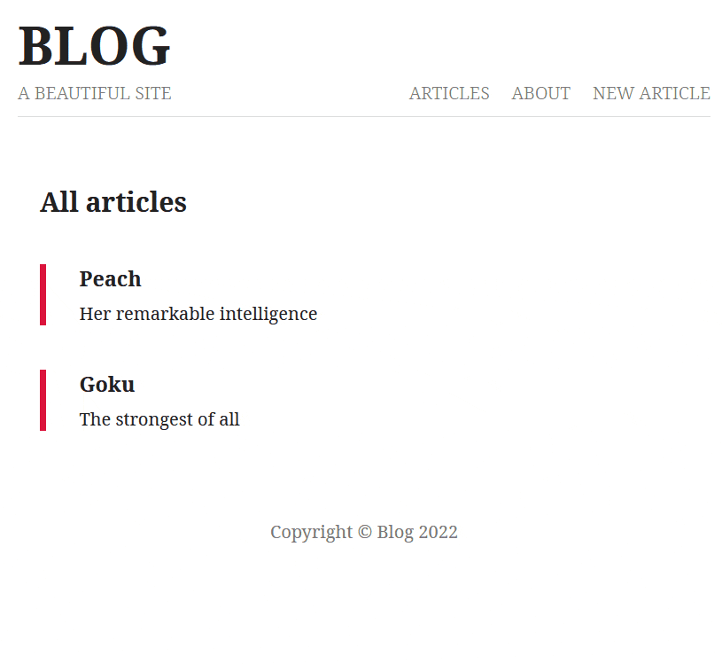

# Node-blog :notebook:

Blog created with [Node.js](https://nodejs.org/en/) ([Express](https://expressjs.com/)) following the [MVC pattern](https://developer.mozilla.org/en-US/docs/Glossary/MVC). It uses [MongoDB Atlas](https://www.mongodb.com/atlas) deployed on [AWS](https://aws.amazon.com/) as a [cloud database](https://www.ibm.com/cloud/learn/what-is-cloud-database), and [EJS](https://ejs.co/) as a template engine ([Server-Side Rendering](https://ageek.dev/server-side-rendering)). The user can create articles, display them, and delete them. The server uses [morgan](https://www.npmjs.com/package/morgan) for its logs, [compresses its HTTP responses](https://en.wikipedia.org/wiki/HTTP_compression) in [.gzip](https://en.wikipedia.org/wiki/Gzip) and secures their [headers](https://developer.mozilla.org/en-US/docs/Web/HTTP/Headers) with [helmet](https://helmetjs.github.io/).

